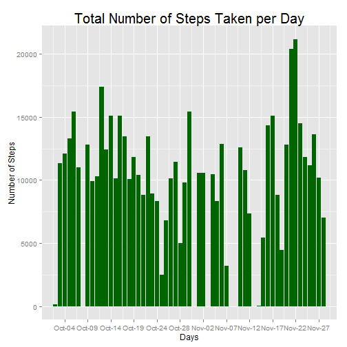
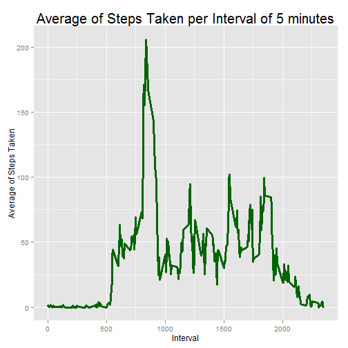
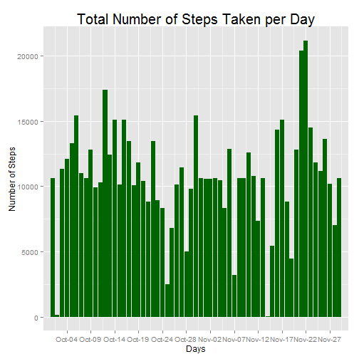
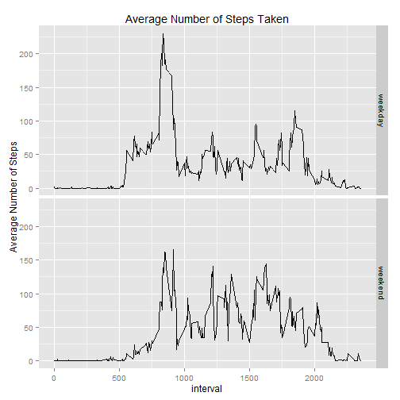

##This file documents the Peer Assessment 1 of the Reproducible Research Coursera Course

## Introduction
This assignment makes use of data from a personal activity monitoring device. This device collects data at 5 minute intervals through out the day. The data consists of two months of data from an anonymous individual collected during the months of October and November, 2012 and include the number of steps taken in 5 minute intervals each day.

##Data

The data for this assignment can be downloaded from the course web site:

Dataset: Activity monitoring data [52K]
The variables included in this dataset are:

- steps: Number of steps taking in a 5-minute interval (missing values are coded as NA)
- date: The date on which the measurement was taken in YYYY-MM-DD format
- interval: Identifier for the 5-minute interval in which measurement was taken

The dataset is stored in a comma-separated-value (CSV) file and there are a total of 17,568 observations in this dataset.

##Loading and Preprocessing the Data


```r
library(data.table)
library(dplyr)

## Read data
df <- fread("activity.csv", header = TRUE, sep = ",", data.table = FALSE )
ad <- tbl_df(df)

## clean missing values 
good <- complete.cases(ad)
ad <- ad[good,]
```

##Questions and Results

###What is mean total number of steps taken per day?

The following code calculates and prints a histogram that shows the total number of steps taken each day. Note that there is some missing values in a few days due to the remove of invalid inputs.


```r
library(ggplot2)
library(scales)
## calculate outputs
grouped_ad <- group_by ( ad, date)
sum_ad <- summarize(grouped_ad, totalstepsperday = sum(steps))
sum_ad <- mutate(sum_ad, datePOSIXct = as.POSIXct (date))
## graph output
g <- ggplot(sum_ad, aes(x=datePOSIXct, y=totalstepsperday ))
g <- g + geom_histogram( stat = "identity", fill = "darkgreen" ) +
        ggtitle("Total Number of Steps Taken per Day") +
        xlab( "Days") +
        ylab( "Number of Steps") +
        theme(plot.title = element_text(size = rel(1.7))) +
        scale_x_datetime(breaks = date_breaks("5 days"),
                        labels = date_format("%b-%d"),
                        limits = c(as.POSIXct("2012-10-02"), 
                                   as.POSIXct("2012-11-29")) )
print(g)
```

 

### What is the mean and median of the total number of steps taken per day?
The following code and calculates and reports the mean and median of the total number of steps taken per day.

```r
grouped_ad <- group_by ( ad, date)
sum_ad <- summarize(grouped_ad, stepsperday = sum(steps))
reported_ad <- summarize(sum_ad, meanstepsperday = mean(stepsperday), 
                                medianstepperday = median(stepsperday))
```
The mean value is 10766.19 and the median is 10765.

###What is the average daily activity pattern?
The following code calculates and prints a time series plot of the 5-minute interval (x-axis) and the average number of steps taken, averaged across all days (y-axis)


```r
grouped_ad <- group_by ( ad, interval)
averaged_ad <-  summarize(grouped_ad, avgstepsperinterval = mean(steps))
g <- ggplot(averaged_ad, aes(x=interval, y=avgstepsperinterval, group = 1 ))
g <- g + geom_line(stat = "identity", size = 1.2, colour = "darkgreen") + 
        ylab("Average of Steps Taken") +
        xlab("Interval") +
        ggtitle("Average of Steps Taken per Interval of 5 minutes") +
        theme(plot.title = element_text(size = rel(1.7)))
print(g)
```

 

The following code and calculates and reports Which 5-minute interval, on average across all the days in the dataset, contains the maximum number of steps.


```r
interval5 <- averaged_ad[averaged_ad$avgstepsperinterval == max(averaged_ad$avgstepsperinterval), 1 ]
```

In thhis particular case the interval that contains the maximum number of steps on the average across all the days is 835.

###Imputing missing values
Note that there are a number of days/intervals where there are missing values (coded as NA). The presence of missing days may introduce bias into some calculations or summaries of the data. The following code calculates the total number of missing values.


```r
ad <- tbl_df(df)
good <- complete.cases(ad)
totalnas <- nrow(ad[!good,] )
```

In this case the total number of missing values is 2304.

In order repair these missing values I'll replace each missing value by the mean of that 5 minutes interval. The following code calculates and prints a histogram that shows the total number of steps taken each day after replacement of missing values.


```r
library(ggplot2)
library(scales)
## replace missing values
adgood <- ad[good,]
adnotgood <- ad[!good,]
grouped_ad <- group_by ( adgood, interval)
meaninterval <- summarize(grouped_ad, stepsperinterval = trunc(mean(steps, rm.na = TRUE), 0))
for ( i in seq_len( nrow(adnotgood) )) {
        intervalinanalize <- as.character(adnotgood[i, 3])
        steps <- meaninterval[meaninterval$interval == intervalinanalize, 2]
        adnotgood[i, 1] <- steps
}
newad <- rbind( adgood, adnotgood)

## calculate outputs
grouped_ad <- group_by ( newad, date)
sum_ad <- summarize(grouped_ad, totalstepsperday = sum(steps))
sum_ad <- mutate(sum_ad, datePOSIXct = as.POSIXct (date))
## graph output
g <- ggplot(sum_ad, aes(x=datePOSIXct, y=totalstepsperday ))
g <- g + geom_histogram( stat = "identity", fill = "darkgreen" ) +
        ggtitle("Total Number of Steps Taken per Day") +
        xlab( "Days") +
        ylab( "Number of Steps") +
        theme(plot.title = element_text(size = rel(1.7))) +
        scale_x_datetime(breaks = date_breaks("5 days"),
                        labels = date_format("%b-%d"),
                        limits = c(as.POSIXct("2012-10-02"), 
                                   as.POSIXct("2012-11-29")) )
print(g)
```

 

### What is the mean and median of the total number of steps taken per day?
The following code and calculates and reports the mean and median of the total number of steps taken per day after replacement of the missing values.

```r
grouped_ad <- group_by ( newad, date)
sum_ad <- summarize(grouped_ad, stepsperday = sum(steps))
reported_ad <- summarize(sum_ad, meanstepsperday = mean(stepsperday), 
                                medianstepperday = median(stepsperday))
```
After the replacement of the missing values the mean value is 10749.77 and the median is 10641.

### Do these values differ from the estimates from the first part of the assignment?  What is the impact of imputing missing data on the estimates of the total daily number of steps?
There some difference in the histogram and the mean now is some far way from the median.

###Are there differences in activity patterns between weekdays and weekends?
The following code and calculates and print a graph with the two patterns of weekdays and weekends

```r
newad <- rbind( adgood, adnotgood)
Sys.setlocale("LC_TIME", "C")
```

```
## [1] "C"
```

```r
newad$weekend <- "weekday"
newad$weekend[weekdays(as.POSIXct(newad$date)) %in% c("Saturday","Sunday")] <- "weekend"
newad$weekend <- as.factor(newad$weekend)
grouped_ad <- group_by ( newad, interval, weekend)
sum_ad <- summarize(grouped_ad, avgsteps = trunc(mean(steps, rm.na = TRUE), 0))
qplot(x = interval, y = avgsteps, data = sum_ad, geom = c("line"), 
      facets = weekend~., main = "Average Number of Steps Taken", 
      ylab = "Average Number of Steps")
```

 

The average number of steps taken based on graph are not so diferente!


